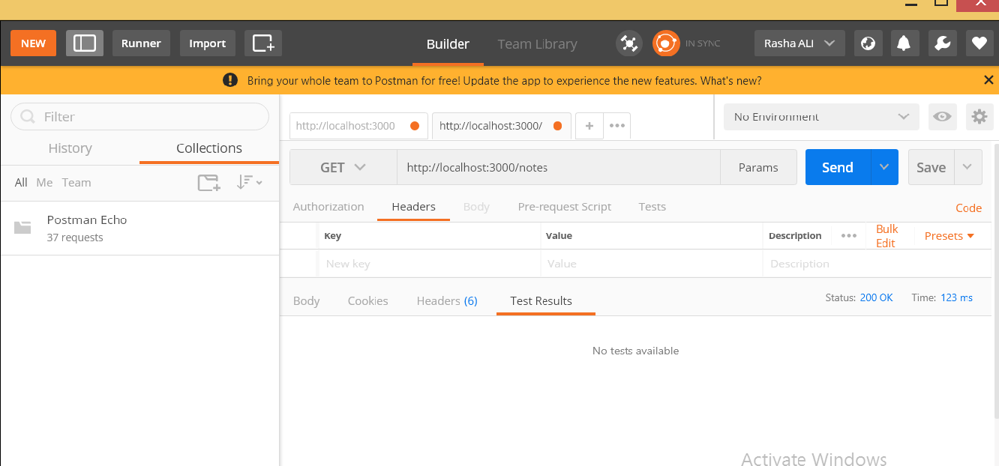

# CRUD-API-with-Node-Express-Monogo

In this tutorial, we’ll be building a RESTful CRUD (Create, Retrieve, Update, Delete) API with Node.js, Express and MongoDB. We’ll use Mongoose for interacting with the MongoDB instance.

Express is one of the most popular web frameworks for node.js. It is built on top of node.js http module, and adds support for routing, middleware, view system etc. It is very simple and minimal, unlike other frameworks that try do way to much, thereby reducing the flexibility for developers to have their own design choices.

Mongoose is an ODM (Object Document Mapping) tool for Node.js and MongoDB. It helps you convert the objects in your code to documents in the database and vice versa.

Before proceeding to the next section, Please install MongoDB in your machine if you have not done already. Checkout the official MogngoDB installation manual for any help with the installation.
Credits goes to this link https://www.callicoder.com/node-js-express-mongodb-restful-crud-api-tutorial/

Our Application

In this tutorial, We will be building a simple Note-Taking application. We will build Rest APIs for creating, listing, editing and deleting a Note.

We’ll start by building a simple web server and then move on to configuring the database, building the Note model and different routes for handling all the CRUD operations.

Finally, we’ll test our REST APIs using Postman.

Also, In this post, we’ll heavily use ES6 features like let, const, arrow functions, promises etc. It’s good to familiarize yourself with these features. I recommend this re-introduction to Javascript to brush up these concepts.

Well! Now that we know what we are going to build, We need a cool name for our application. Let’s call our application EasyNotes.
